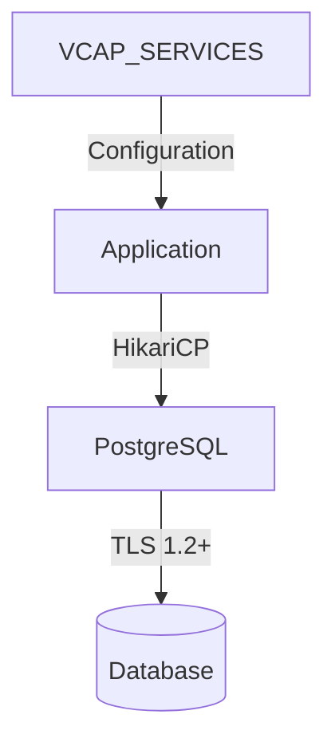

# SAP BTP – Ktor CRUD API with PostgreSQL, XSUAA & Arrow KT

This project is a **production-ready Kotlin Ktor REST API** designed **exclusively for deployment on SAP BTP Cloud Foundry**.

It demonstrates how to build a secure, robust, and maintainable backend service using:

- **SAP BTP XSUAA** for JWT-based authentication
- **PostgreSQL on BTP** with Exposed ORM
- **Arrow KT (v 2.2.1.1)** for typed, explicit error handling
- **Clean Architecture** with strict separation of concerns
- **Correct REST semantics** (HTTP status codes, `Location` header, no error codes embedded in payloads)

> ⚠️ This application is **not intended for local execution**.  
> All configuration and credentials are resolved from **SAP BTP Cloud Foundry (`VCAP_SERVICES`)**.

---

## Architecture Overview

The application follows a **clean, layered architecture**:

```
src/main/kotlin/
├── Application.kt
├── di/
├── routing/
├── security/
├── db/
├── repository/
├── service/
├── dto/
├── model/
└── util/
```

---

## Arrow KT Usage

Arrow KT is used to **model expected failures explicitly**, instead of relying on exceptions, `null`, or boolean flags.

### Core concepts

- `Either<E, A>` — represents failure (`E`) or success (`A`)
- Raise DSL (`either {}`, `bind()`)
- `ensure`, `ensureNotNull`
- `fold` for boundary handling

Arrow is used in DB, repository, and service layers.  
Arrow is unwrapped only at boundaries (routing, DI, startup).

---

## Database Architecture

### Core Components

- **HikariCP**: High-performance JDBC connection pool
- **Exposed**: Type-safe SQL DSL and lightweight ORM
- **PostgreSQL**: SAP BTP's managed PostgreSQL service
- **TLS 1.2+**: Enforced for all database connections

### Connection Management



### Configuration

#### Environment Variables

| Variable | Description | Default |
|----------|-------------|---------|
| `DB_SERVICE_NAME` | PostgreSQL service name in VCAP_SERVICES | `postgreSQL-dev` |
| `PG_SSLMODE` | PostgreSQL SSL mode | `verify-full` |
| `DB_POOL_MAX` | Maximum pool size | 10 |
| `DB_POOL_MIN` | Minimum idle connections | 2 |
| `DB_POOL_IDLE_TIMEOUT_MS` | Connection idle timeout | 600000 (10m) |
| `DB_POOL_MAX_LIFETIME_MS` | Maximum connection lifetime | 1800000 (30m) |

#### Connection Pool Settings

- **Validation Queries**: Automatic connection validation
- **Leak Detection**: Enabled with 60s threshold
- **Auto-commit**: Disabled for transaction control
- **Isolation Level**: `TRANSACTION_READ_COMMITTED`

### TLS Configuration

SAP BTP PostgreSQL enforces TLS 1.2+ with the following setup:

1. **Certificate Handling**:
   - CA certificate extracted from `VCAP_SERVICES`
   - Written to `/tmp/btp-pg-root.crt`
   - Automatically cleaned up on application shutdown

2. **JDBC URL Configuration**:
   ```properties
   jdbc:postgresql://{host}:{port}/{dbname}
     ?sslmode=verify-full
     &sslrootcert=/tmp/btp-pg-root.crt
     &tcpKeepAlive=true
   ```

### Error Handling

#### Database Errors

```kotln
sealed interface DbError {
    data class Connection(val cause: Throwable) : DbError
    data class Constraint(val name: String?, val cause: Throwable) : DbError
    data class Unexpected(val cause: Throwable) : DbError
    // ... other error types
}
```

#### Recovery Strategies

1. **Connection Failures**:
   - Automatic retry with exponential backoff
   - Circuit breaker pattern for cascading failures
   - Graceful degradation of non-critical features

2. **Constraint Violations**:
   - Unique constraint violations mapped to `409 Conflict`
   - Foreign key violations mapped to `404 Not Found`
   - Validation errors mapped to `400 Bad Request`

### Performance Considerations

1. **Connection Pooling**:
   - Tuned for SAP BTP PostgreSQL service limits
   - Dynamic resizing based on load
   - Connection validation before use

2. **Query Optimization**:
   - Indexed foreign keys
   - Batched inserts/updates
   - Pagination for large result sets

3. **Monitoring**:
   - JMX metrics for pool statistics
   - Slow query logging
   - Connection leak detection

### Schema Management

Schema is managed through Exposed's `SchemaUtils` with automatic migrations:

```kotlin
transaction(database) {
    SchemaUtils.createMissingTablesAndColumns(Users)
}
```


## Final Notes

This project demonstrates:

- Modern Kotlin backend design
- Functional error handling with Arrow KT
- Enterprise-grade SAP BTP integration
- Clean REST APIs

Designed to be **fail-fast and production-safe**.
